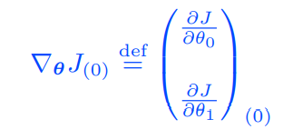

# Artificial Intelligence for Aerospace Engineers

## Lecture 1 (Introduction)

- Machines are great at finding correlations; but bad **interpretability** and **robustness** to data
- Humans are good at finding principles; don't forget about the causes/approaches available when solving problems!

Admin:
- 17h lectures, 2h computing, 5h computing tutorials
- 70% final exam, 30% weekly assignments (need to pass 4/6 minimum; pass fail 3 attempts autograder)
- MCQ, 1.5h, theory and good practice (no coding exercises); weekly quizzes designed similarly

Definitions:
- Artificial intelligence: study and design of intelligent agents
- Machine learning: tool that can use data (inputs) to give a prediction (outputs)
- Data science and data mining: statistical inference, data visualization, communication; extract knowledge from data
- Deep learning: multilayered NNs learn from vast amounts of data

Why AI in Aerospace Engineering:
- Vast and increasing data
- Advances in HPC (Moore's law)
- Improvements to sensing technologies, data storage and transfer
- Scalable algorithms from statistics and applied mathematics
- Considerably investment by industry, leading to an abundance of open source software
- Digital thread and digital twin: digitalization every stage of design/manufacture of product, collect data at every stage (digital thread), very accurate model of product (digital twin)

Types of AI Algorithms:
- Supervised learning: describe features and labels for data (e.g. regression)
- Unsupervised learning: describe data, algorithm to cluster data according to some similarity (define its own features to separate data into classes)
- Semi-supervised learning: inbetween, such as **reinforcement learning** 

Machine learning workflow:
- Data: acquisition, analysis, pre-processing
- Model: design, adjustment/tuning
- Training: optimisation, evaluation
- Deployment

## Lecture 2 (Linear regression)

### One variable linear regression

The goal of regression: find `f` such that `f(x)` approximates `y`. Regression analysis consists of the following steps:

1. Select a **hypothesis function** `h(x)` which (we assume) models the data. Here, we choose `h(x)` to be linear, assume that `y` = `h(x)` = `\theta_0 + \theta_1 * x`. Where `\theta_0` is the intercept, `\theta_1` is the slope to be found
2. **Loss function** measures the error between the data points `y_i` and the predictions from our model `h(x_i)`. We choose the mean-squared error (MSE) to globally measure the quality of the predictions

3. **Training**/*Learning*. Find the two parameters of the linear model `\theta_0` and `\theta_1` for the loss function to be minimised. This optimal set of parameters corresponds to the "best" linear model: an optimisation problem

### Gradient Descent

To solve the minimisation problem, start at a point, find the direction of maximum decrease of the loss function, then take a step in that direction, and iterate until the loss function cannot decrease anymore.

1. **Choose a starting point**. Choose an initial guess of `\theta_0` and `\theta_1`, normally done by randomly guessing.
2. **Calculate the gradient**. Calculate the gradient of the loss function with respect to an infinitesimal change in your parameters `\theta_0` and `\theta_1`. This will give the direction along which the loss function increases the most:

3. **Update**. Take a small step in the direction of the most negative gradient (largest descent) and update your parameters `\theta_0` and `\theta_1`.