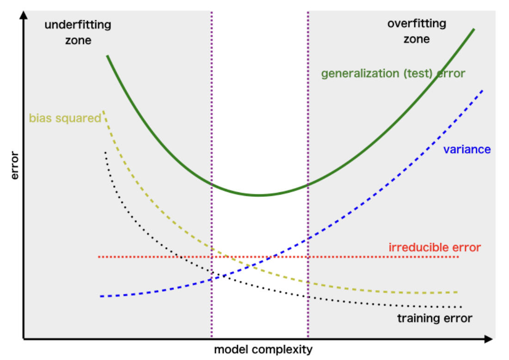
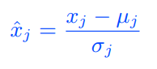
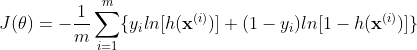

# Artificial Intelligence for Aerospace Engineers

## Lecture 1 (Introduction)

- Machines are great at finding correlations; but bad **interpretability** and **robustness** to data
- Humans are good at finding principles; don't forget about the causes/approaches available when solving problems!

Admin:
- 17h lectures, 2h computing, 5h computing tutorials
- 70% final exam, 30% weekly assignments (need to pass 4/6 minimum; pass fail 3 attempts autograder)
- MCQ, 1.5h, theory and good practice (no coding exercises); weekly quizzes designed similarly

Definitions:
- Artificial intelligence: study and design of intelligent agents
- Machine learning: tool that can use data (inputs) to give a prediction (outputs)
- Data science and data mining: statistical inference, data visualization, communication; extract knowledge from data
- Deep learning: multilayered NNs learn from vast amounts of data

Why AI in Aerospace Engineering:
- Vast and increasing data
- Advances in HPC (Moore's law)
- Improvements to sensing technologies, data storage and transfer
- Scalable algorithms from statistics and applied mathematics
- Considerably investment by industry, leading to an abundance of open source software
- Digital thread and digital twin: digitalization every stage of design/manufacture of product, collect data at every stage (digital thread), very accurate model of product (digital twin)

Types of AI Algorithms:
- Supervised learning: describe features and labels for data (e.g. regression)
- Unsupervised learning: describe data, algorithm to cluster data according to some similarity (define its own features to separate data into classes)
- Semi-supervised learning: inbetween, such as **reinforcement learning** 

Machine learning workflow:
- Data: acquisition, analysis, pre-processing
- Model: design, adjustment/tuning
- Training: optimisation, evaluation
- Deployment

## Lecture 2 (Linear regression)

### One variable linear regression

The goal of regression: find `f` such that `f(x)` approximates `y`. Regression analysis consists of the following steps:

1. Select a **hypothesis function** `h(x)` which (we assume) models the data. Here, we choose `h(x)` to be linear, assume that `y` = `h(x)` = `\theta_0 + \theta_1 * x`. Where `\theta_0` is the intercept, `\theta_1` is the slope to be found
2. **Loss function** measures the error between the data points `y_i` and the predictions from our model `h(x_i)`. We choose the mean-squared error (MSE) to globally measure the quality of the predictions

3. **Training**/*Learning*. Find the two parameters of the linear model `\theta_0` and `\theta_1` for the loss function to be minimised. This optimal set of parameters corresponds to the "best" linear model: an optimisation problem

### Gradient Descent

To solve the minimisation problem, start at a point, find the direction of maximum decrease of the loss function, then take a step in that direction, and iterate until the loss function cannot decrease anymore.

1. **Choose a starting point**. Choose an initial guess of `\theta_0` and `\theta_1`, normally done by randomly guessing.
2. **Calculate the gradient**. Calculate the gradient of the loss function with respect to an infinitesimal change in your parameters `\theta_0` and `\theta_1`. This will give the direction along which the loss function increases the most:

3. **Update**. Take a small step in the direction of the most negative gradient (largest descent) and update your parameters `\theta_0` and `\theta_1`.

4. **Repeat**. The loss function MSE is quadratic; gradient changes linearly. Therefore, we need to update the gradient at the new point, and repeat steps 1-3 until the variation of the cost function is zero (to *numerical tolerance*) and/or a *maximum number of iterations* is reached. Both of these training parameters are user-defined.

Example of calculating gradient descent by hand:

### Multi-variable linear regression

For multi-variable functions, we generalise to `N` features. The steps taken are similar to the one-variable case, except we generalise to `N` features `x_1 ... x_N`, and `N+1` parameters `\theta_0 ... \theta_N`.

1. **Hypothesis**. Select a multi-variable linear hypothesis function:

2. **Loss function**. Mean-squared error (MSE):

3. **Training**. Find the `N+1` parameters of the linear model to minimise loss `J`

As before, gradient descent consists of the same steps:

Example of calculating multi-variable gradient descent by hand:

The path taken by gradient descent can be far more complicated:

### Vectorization

Vectorization enables a compact notation, which is easy to program in computer code and faster to execute. This is why linear algebra is so widely used in machine learning.

### Regularization

Loss (in this case MSE) measures the *training error*, which is only relevant to the train set. The error between the prediction on unseen features and the test set is *generalization error*. A small training error is not sufficient; it may:

* **Underfit** when training error is too large; model has a high bias. Possibly too few parameters/*capacity*.
* **Overfit** when training error is small; but generalization error is large. *Generalization gap* is large; model has a high variance. Possibly too many parameters/*capacity*.

A good machine learning model should have a good *bias-variance trade off*. This can be achieved by minimising the generalisation error, which is a sum of the (squared) bias and the variance. This can be practically achieved by **regularizing** the problem. Add an extra term in the loss function with regularization parameter `\lambda`:

If `\lambda` = 0, problem is not regularized.
If `\lambda` is small, large values of `\sum \theta_j ^2` are allowed; model might contain too many parameters; might overfit.
If `\lambda` is large, only small values of `\sum \theta_j ^2` are allowed; training will reduce the number of parameters; might underfit.

`\lambda` has a typical range of values between `1e-6` to `1e-2` but is strongly problem dependent and difficult to generalise.

### Learning rate and feature scaling

**Learning rate**. Small values of `lr` make gradient descent converge to an accurate minimum, but may be time consuming. Large values of `lr` might make gradient descent converge to an inaccurate minimum / diverge, but computation will be cheap. Adaptive learning rates are possible with the [*Adaptive Moment Estiation* (ADAM) optimiser](https://machinelearningmastery.com/adam-optimization-algorithm-for-deep-learning/#:~:text=Adam%20is%20a%20replacement%20optimization,sparse%20gradients%20on%20noisy%20problems), which uses the information of previous gradients to accelerate convergence. Typical values are `0.001 - 1` usually in step multiples of 3.

**Feature scaling**. Sometimes features have different absolute values; the larger variable will have a larger variation with respect to the parameters `\theta_N`, thus will be much more heavily influenced by that feature. Convergence in the direction of other features is slow. The algorithm will converge faster if the range of the feature has the same order of magnitude. We scale the values to standardise each feature:

where `^` denotes normalisation, `\mu_j` is the mean value and `\sigma_j` is the standard deviation of `x_j`.

### Variations of gradient descent

* **Batch gradient descent**. What we have been looking at thus far. The whole training dataset (*batch*) is used at each iteration. The gradient points in the steepest gradient direction, but the algorithm is prone to overfitting and needs large memory requirements for large datasets.
* **Stochastic gradient descent**. Only one data point is selected at random to be used at each iteration. Gradient may not point in the steepest descent direction, progress may be noisy, convergence may be slow, less prone to overfitting.
* **Mini-batch gradient descent**. A hybrid approach between the previous two. The training set is divided into small batches, gradient is computed in each *mini-batch*. Algorithm is quick and can be easily parallelised in computer software because each mini-batch gradient computation is independent; results may depend on batch size, less prone to overfitting.

Additionally, training data can be re-shuffled randomly a number of times and repeated in *epochs*. This minimises the importance of the last seen datapoint and improves convergence. In most ML libraries, mini-batch gradient descent is applied, where you can select a custom batch size.

## Lecture 3 (Logistic Regression)

Logistic regression is the fundamental concept upon which neural networks are built. It allow us to interpolate non-linear patterns in data, commonly used in classification (**discrete classes**). In the realm of continuous functions, we look for a function as close as possible to a discontinuous step function; but it is continuous. A commonly-used function is the **sigmoid**, for two discrete classes.

The **sigmoid function** is a non linear **activation function**. As in linear regression, we assume that `z` is a linear function with respect to the inputs.

For logistic regression, we choose the sgmoid to be the hypothesis function:

This hypothesis function modesl the probability that a given set of features belong to a class. `h(class=1|x)` is the posterior probability, observe features `x`, the probability of belonging to class `1` is `h`. Use the sigmoid function `h = \sigma` to model the probability.

### Loss function

We look for a loss function that is 0 if the prediction matches the label. Convex loss function (only one minimum). This is the *cross-entropy loss function*.

If the label is `yi = 1`, the loss function is `J(\theta)`. If the prediction is correct; `h=1` then `J(\theta)=0` as expected (zero cost, perfect prediction.) If incorrect; `h=0` then `J(\theta)= \inf` as expected for a completely wrong answer. Thanks to these logarithms, the loss function is convex, with only one minimum.

From a probabilistic point of view, the cross entropy gives a measure of the uncertainty of the machine learning prediction. The higher the cross entropy, the more uncertain (hence, less accurate) the prediction is. Our goal is to minimise the uncertainty of our classification model; hence minimise this cross entropy.

#### Example: Calculate the gradient of the loss function (gradient descent)

1. Choose a starting point
2. Calculate the gradient with the equation above
3. Update and repeat

### Logistic regularization

We want to prevent overfitting, by adding a regulatization parameter to the loss function, exactly in the same manner as in linear regression.

### Threshold and decision boundary

The *threshold* is the value of `\sigma(z)` that divides the classification from one class to another. The *decision boundary* partitions the feature space, `x`, into two sets, one for each class. The decision boundary is linear in logistic regression, unless we add nonlinear features (SVMs). The threhold is user-defined, usually assumed to be 0.5.

This is a maximisation problem, hyperplane as far as possible from each class (margin, `m`). `m = 2 / ||w||`.

### Multi-class problems

*One-versus-all* performs binary classification several times in multiclass problems. Need `k` logistic regression classifiers for `k` classes.

### Metrics for classification

**Accuracy**: the percentage of correct predictions. True positives + True negatives / total
**Precision**: the percentage of predicted positives that are actual positives. True positives / true positives + false positives
**Recall**: the percentage of actual positives that were correctly predicted to be positives. True positives / true positives + false negatives

It is common to combine the two metrics into the geometric mean, which is the F-score. Ideally, value of 1.

### Support Vector Machines (SVMs)

In logistic regression, we want a good regression function that interpolates our data well; thus decision boundary may not maximise the margin. In support vector machines, we focus only on the decision boundary, which is the hyperplane with the largest margin between the two classes. The equation of a hyperplane:

Given a point `x_B`, the distance of it from the hyperplane is the *residual*, `f` of the hyperplane equation.

Therefore, the distance `x_B` from the hyperplane is:

In logistic regression, the decision boundary depends on the activation function. In SVMs, the decision boundary is optimal.

#### Optimal hyperplane

The optimal hyperplane is the hyperplane that separates the two points with the largest margin. First, we consider the point that is closest to the decision boundary, `x_A`. The optimal hyperplane between two points is placed at the sme distance from either point, at:

We normalise the above equation by `M`, which yields:

Solve for the *largest margin* hyperplane by finding `w`, `b` such that 2/`norm(w)` is maximum.

#### Linearly separable classes (hard margin)

If the classes are linearly separable, then there must exist an optimal hyperplane. This is the solution of a constrained minimization problem of the cost function, which maximises the margin. This is usually solved with sequential minimal optimisation with the [Lagrangian dual](https://liyanxu.blog/2018/11/02/overview-svm-optimization/).

#### Regularization and soft margins

If the data is not linearly separable, there will be no solution for which all the data points are correctly classified. We introduce a *slack variable*, `\eta_i >= 0` such that `\eta_i` = 0 for correctly classified points on or outside margin, 0 < `\eta_i` <= 1 for correctly classified points inside the margin, and `\eta_i` > 1 for misclassified points.

The slack variable is not prescribed; rather it is found in the optimisation problems. We replace the hard constraints with the soft constraint `1 - \eta_i`. Hence, the optimisation problem is:

As `C` approaches `\inf`, we get the hard margin. This might overfit outliers or noisy data, increasing the generalisation error. The smaller the `C`, the softer the margin. The soft/wide margin allows some points to be misclassified while mitigating overfitting.

### Nonlinearly separable classes: The kernel trick

For non linearly separable data, a hyperplane would misclassify many points. A few options to learn nonlinear decision boundaries:

**Enriching the data**. This can be achieved by mapping the data into a nonlinear higher-dimensional space, such that the distance of a point from the decision boundary becomes linearly separated. It may be computationally expensive because we add degrees of freedom into the optimisation problem through `w`. We can make it cheap with the kernel trick.

**Kernel trick**. We decompose the weight vector in the transformed feature space:

Function `K` is the *kernel*. This implies: we do not need to increase the dimension of the feature space to include nonlinearities. We only need to apply the kernel to inner products in the original feature space. In doing so, we are finding the optimal separating hyperplane without calculating anything about `\phi(x^i)`. *The kernel trick enables a higher-dimensional feature space with no extra cost*.

Common kernels are:

The *Matern* kernel is also common. If the size of the problem is not too large, use different kernels and compare the performances through cross-validation, and select the kernel that performs best.

### The training algorithm (SVMs)

The optimisation problem of SVMs can be solved efficiently with sequential minimal optimisation.

1. Set a kernel and a regularisation parameter
2. Find support vectors
3. Maximise the regularised margin
4. If no point is misclassified, stop. Otherwise, go back to point 2 and repeat until no points are misclassified

The pros and cons of SVMs are:

### [Optional] Lagrangian Dual

#### Karush-Kuhn-Tucker (KKT) Conditions

To turn the constrained optimisation problem with inequality constraints, into an unconstrained optimsation problem, we add zero to the loss function.

If the point `x^i` is on the boundary of the margin, the constraints are active (`a_i` = 1). If the point is not on the boundary but it is correctly classified, the constraints are not active (`a_i` = 0). For misclassified points (`a_i` > 1), with the loss function increasing as the point moves farther away. The functional `L` is the *Lagrangian*. The yet-undefined quantities are the KKT multipliers.

#### Langrangian dual

At an optimum point, the gradient of the Lagrangian is zero, `\nabla L = 0`, hence:

This is called the *Lagrangian dual*, it can be shown that the optimisation problem becomes a maximisatino problem for the KKT multipliers.

Because each iteration considers only two points and the solution of the Lagrangian dual can be found analytically, the training of SVMs is fast; with [sequential minimal optimisation](https://www.microsoft.com/en-us/research/wp-content/uploads/2016/02/tr-98-14.pdf). It can be shown that the KKT multipliers of the regularised dual problem are between 0 and `C` inclusive.

For nonlinearly separable data, we apply the kernel function `K` to the inner product of the support vectors. We just need to apply a kernel to the inner product in the Lagrangian dual.

High level overview of SVM optimisation with sequential minimal optimisation:

