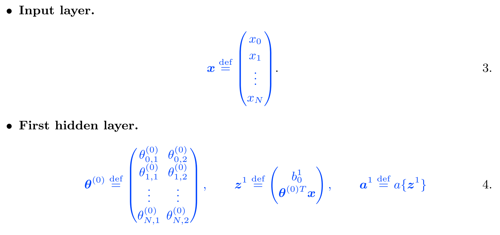

# Artificial Intelligence for Aerospace Engineers

## Lecture 1 (Introduction)

- Machines are great at finding correlations; but bad **interpretability** and **robustness** to data
- Humans are good at finding principles; don't forget about the causes/approaches available when solving problems!

Admin:
- 17h lectures, 2h computing, 5h computing tutorials
- 70% final exam, 30% weekly assignments (need to pass 4/6 minimum; pass fail 3 attempts autograder)
- MCQ, 1.5h, theory and good practice (no coding exercises); weekly quizzes designed similarly

Definitions:
- Artificial intelligence: study and design of intelligent agents
- Machine learning: tool that can use data (inputs) to give a prediction (outputs)
- Data science and data mining: statistical inference, data visualization, communication; extract knowledge from data
- Deep learning: multilayered NNs learn from vast amounts of data

Why AI in Aerospace Engineering:
- Vast and increasing data
- Advances in HPC (Moore's law)
- Improvements to sensing technologies, data storage and transfer
- Scalable algorithms from statistics and applied mathematics
- Considerably investment by industry, leading to an abundance of open source software
- Digital thread and digital twin: digitalization every stage of design/manufacture of product, collect data at every stage (digital thread), very accurate model of product (digital twin)

Types of AI Algorithms:
- Supervised learning: describe features and labels for data (e.g. regression)
- Unsupervised learning: describe data, algorithm to cluster data according to some similarity (define its own features to separate data into classes)
- Semi-supervised learning: inbetween, such as **reinforcement learning** 

Machine learning workflow:
- Data: acquisition, analysis, pre-processing
- Model: design, adjustment/tuning
- Training: optimisation, evaluation
- Deployment

## Lecture 2 (Linear regression)

### One variable linear regression

The goal of regression: find `f` such that `f(x)` approximates `y`. Regression analysis consists of the following steps:

1. Select a **hypothesis function** `h(x)` which (we assume) models the data. Here, we choose `h(x)` to be linear, assume that `y` = `h(x)` = `\theta_0 + \theta_1 * x`. Where `\theta_0` is the intercept, `\theta_1` is the slope to be found
2. **Loss function** measures the error between the data points `y_i` and the predictions from our model `h(x_i)`. We choose the mean-squared error (MSE) to globally measure the quality of the predictions

3. **Training**/*Learning*. Find the two parameters of the linear model `\theta_0` and `\theta_1` for the loss function to be minimised. This optimal set of parameters corresponds to the "best" linear model: an optimisation problem

### Gradient Descent

To solve the minimisation problem, start at a point, find the direction of maximum decrease of the loss function, then take a step in that direction, and iterate until the loss function cannot decrease anymore.

1. **Choose a starting point**. Choose an initial guess of `\theta_0` and `\theta_1`, normally done by randomly guessing.
2. **Calculate the gradient**. Calculate the gradient of the loss function with respect to an infinitesimal change in your parameters `\theta_0` and `\theta_1`. This will give the direction along which the loss function increases the most:

3. **Update**. Take a small step in the direction of the most negative gradient (largest descent) and update your parameters `\theta_0` and `\theta_1`.

4. **Repeat**. The loss function MSE is quadratic; gradient changes linearly. Therefore, we need to update the gradient at the new point, and repeat steps 1-3 until the variation of the cost function is zero (to *numerical tolerance*) and/or a *maximum number of iterations* is reached. Both of these training parameters are user-defined.

Example of calculating gradient descent by hand:

### Multi-variable linear regression

For multi-variable functions, we generalise to `N` features. The steps taken are similar to the one-variable case, except we generalise to `N` features `x_1 ... x_N`, and `N+1` parameters `\theta_0 ... \theta_N`.

1. **Hypothesis**. Select a multi-variable linear hypothesis function:

2. **Loss function**. Mean-squared error (MSE):

3. **Training**. Find the `N+1` parameters of the linear model to minimise loss `J`

As before, gradient descent consists of the same steps:

Example of calculating multi-variable gradient descent by hand:

The path taken by gradient descent can be far more complicated:

### Vectorization

Vectorization enables a compact notation, which is easy to program in computer code and faster to execute. This is why linear algebra is so widely used in machine learning.

### Regularization

Loss (in this case MSE) measures the *training error*, which is only relevant to the train set. The error between the prediction on unseen features and the test set is *generalization error*. A small training error is not sufficient; it may:

* **Underfit** when training error is too large; model has a high bias. Possibly too few parameters/*capacity*.
* **Overfit** when training error is small; but generalization error is large. *Generalization gap* is large; model has a high variance. Possibly too many parameters/*capacity*.

A good machine learning model should have a good *bias-variance trade off*. This can be achieved by minimising the generalisation error, which is a sum of the (squared) bias and the variance. This can be practically achieved by **regularizing** the problem. Add an extra term in the loss function with regularization parameter `\lambda`:

If `\lambda` = 0, problem is not regularized.
If `\lambda` is small, large values of `\sum \theta_j ^2` are allowed; model might contain too many parameters; might overfit.
If `\lambda` is large, only small values of `\sum \theta_j ^2` are allowed; training will reduce the number of parameters; might underfit.

`\lambda` has a typical range of values between `1e-6` to `1e-2` but is strongly problem dependent and difficult to generalise.

### Learning rate and feature scaling

**Learning rate**. Small values of `lr` make gradient descent converge to an accurate minimum, but may be time consuming. Large values of `lr` might make gradient descent converge to an inaccurate minimum / diverge, but computation will be cheap. Adaptive learning rates are possible with the [*Adaptive Moment Estiation* (ADAM) optimiser](https://machinelearningmastery.com/adam-optimization-algorithm-for-deep-learning/#:~:text=Adam%20is%20a%20replacement%20optimization,sparse%20gradients%20on%20noisy%20problems), which uses the information of previous gradients to accelerate convergence. Typical values are `0.001 - 1` usually in step multiples of 3.

**Feature scaling**. Sometimes features have different absolute values; the larger variable will have a larger variation with respect to the parameters `\theta_N`, thus will be much more heavily influenced by that feature. Convergence in the direction of other features is slow. The algorithm will converge faster if the range of the feature has the same order of magnitude. We scale the values to standardise each feature:

where `^` denotes normalisation, `\mu_j` is the mean value and `\sigma_j` is the standard deviation of `x_j`.

### Variations of gradient descent

* **Batch gradient descent**. What we have been looking at thus far. The whole training dataset (*batch*) is used at each iteration. The gradient points in the steepest gradient direction, but the algorithm is prone to overfitting and needs large memory requirements for large datasets.
* **Stochastic gradient descent**. Only one data point is selected at random to be used at each iteration. Gradient may not point in the steepest descent direction, progress may be noisy, convergence may be slow, less prone to overfitting.
* **Mini-batch gradient descent**. A hybrid approach between the previous two. The training set is divided into small batches, gradient is computed in each *mini-batch*. Algorithm is quick and can be easily parallelised in computer software because each mini-batch gradient computation is independent; results may depend on batch size, less prone to overfitting.

Additionally, training data can be re-shuffled randomly a number of times and repeated in *epochs*. This minimises the importance of the last seen datapoint and improves convergence. In most ML libraries, mini-batch gradient descent is applied, where you can select a custom batch size.

## Lecture 3 (Logistic Regression)

Logistic regression is the fundamental concept upon which neural networks are built. It allow us to interpolate non-linear patterns in data, commonly used in classification (**discrete classes**). In the realm of continuous functions, we look for a function as close as possible to a discontinuous step function; but it is continuous. A commonly-used function is the **sigmoid**, for two discrete classes.

The **sigmoid function** is a non linear **activation function**. As in linear regression, we assume that `z` is a linear function with respect to the inputs.

For logistic regression, we choose the sgmoid to be the hypothesis function:

This hypothesis function modesl the probability that a given set of features belong to a class. `h(class=1|x)` is the posterior probability, observe features `x`, the probability of belonging to class `1` is `h`. Use the sigmoid function `h = \sigma` to model the probability.

### Loss function

We look for a loss function that is 0 if the prediction matches the label. Convex loss function (only one minimum). This is the *cross-entropy loss function*.

If the label is `yi = 1`, the loss function is `J(\theta)`. If the prediction is correct; `h=1` then `J(\theta)=0` as expected (zero cost, perfect prediction.) If incorrect; `h=0` then `J(\theta)= \inf` as expected for a completely wrong answer. Thanks to these logarithms, the loss function is convex, with only one minimum.

From a probabilistic point of view, the cross entropy gives a measure of the uncertainty of the machine learning prediction. The higher the cross entropy, the more uncertain (hence, less accurate) the prediction is. Our goal is to minimise the uncertainty of our classification model; hence minimise this cross entropy.

#### Example: Calculate the gradient of the loss function (gradient descent)

1. Choose a starting point
2. Calculate the gradient with the equation above
3. Update and repeat

### Logistic regularization

We want to prevent overfitting, by adding a regulatization parameter to the loss function, exactly in the same manner as in linear regression.

### Threshold and decision boundary

The *threshold* is the value of `\sigma(z)` that divides the classification from one class to another. The *decision boundary* partitions the feature space, `x`, into two sets, one for each class. The decision boundary is linear in logistic regression, unless we add nonlinear features (SVMs). The threhold is user-defined, usually assumed to be 0.5.

This is a maximisation problem, hyperplane as far as possible from each class (margin, `m`). `m = 2 / ||w||`.

### Multi-class problems

*One-versus-all* performs binary classification several times in multiclass problems. Need `k` logistic regression classifiers for `k` classes.

### Metrics for classification

**Accuracy**: the percentage of correct predictions. True positives + True negatives / total
**Precision**: the percentage of predicted positives that are actual positives. True positives / true positives + false positives
**Recall**: the percentage of actual positives that were correctly predicted to be positives. True positives / true positives + false negatives

It is common to combine the two metrics into the geometric mean, which is the F-score. Ideally, value of 1.

### Support Vector Machines (SVMs)

In logistic regression, we want a good regression function that interpolates our data well; thus decision boundary may not maximise the margin. In support vector machines, we focus only on the decision boundary, which is the hyperplane with the largest margin between the two classes. The equation of a hyperplane:

Given a point `x_B`, the distance of it from the hyperplane is the *residual*, `f` of the hyperplane equation.

Therefore, the distance `x_B` from the hyperplane is:

In logistic regression, the decision boundary depends on the activation function. In SVMs, the decision boundary is optimal.

#### Optimal hyperplane

The optimal hyperplane is the hyperplane that separates the two points with the largest margin. First, we consider the point that is closest to the decision boundary, `x_A`. The optimal hyperplane between two points is placed at the sme distance from either point, at:

We normalise the above equation by `M`, which yields:

Solve for the *largest margin* hyperplane by finding `w`, `b` such that 2/`norm(w)` is maximum.

#### Linearly separable classes (hard margin)

If the classes are linearly separable, then there must exist an optimal hyperplane. This is the solution of a constrained minimization problem of the cost function, which maximises the margin. This is usually solved with sequential minimal optimisation with the [Lagrangian dual](https://liyanxu.blog/2018/11/02/overview-svm-optimization/).

#### Regularization and soft margins

If the data is not linearly separable, there will be no solution for which all the data points are correctly classified. We introduce a *slack variable*, `\eta_i >= 0` such that `\eta_i` = 0 for correctly classified points on or outside margin, 0 < `\eta_i` <= 1 for correctly classified points inside the margin, and `\eta_i` > 1 for misclassified points.

The slack variable is not prescribed; rather it is found in the optimisation problems. We replace the hard constraints with the soft constraint `1 - \eta_i`. Hence, the optimisation problem is:

As `C` approaches `\inf`, we get the hard margin. This might overfit outliers or noisy data, increasing the generalisation error. The smaller the `C`, the softer the margin. The soft/wide margin allows some points to be misclassified while mitigating overfitting.

### Nonlinearly separable classes: The kernel trick

For non linearly separable data, a hyperplane would misclassify many points. A few options to learn nonlinear decision boundaries:

**Enriching the data**. This can be achieved by mapping the data into a nonlinear higher-dimensional space, such that the distance of a point from the decision boundary becomes linearly separated. It may be computationally expensive because we add degrees of freedom into the optimisation problem through `w`. We can make it cheap with the kernel trick.

**Kernel trick**. We decompose the weight vector in the transformed feature space:

Function `K` is the *kernel*. This implies: we do not need to increase the dimension of the feature space to include nonlinearities. We only need to apply the kernel to inner products in the original feature space. In doing so, we are finding the optimal separating hyperplane without calculating anything about `\phi(x^i)`. *The kernel trick enables a higher-dimensional feature space with no extra cost*.

Common kernels are:

The *Matern* kernel is also common. If the size of the problem is not too large, use different kernels and compare the performances through cross-validation, and select the kernel that performs best.

### The training algorithm (SVMs)

The optimisation problem of SVMs can be solved efficiently with sequential minimal optimisation.

1. Set a kernel and a regularisation parameter
2. Find support vectors
3. Maximise the regularised margin
4. If no point is misclassified, stop. Otherwise, go back to point 2 and repeat until no points are misclassified

The pros and cons of SVMs are:

### [Optional] Lagrangian Dual

#### Karush-Kuhn-Tucker (KKT) Conditions

To turn the constrained optimisation problem with inequality constraints, into an unconstrained optimsation problem, we add zero to the loss function.

If the point `x^i` is on the boundary of the margin, the constraints are active (`a_i` = 1). If the point is not on the boundary but it is correctly classified, the constraints are not active (`a_i` = 0). For misclassified points (`a_i` > 1), with the loss function increasing as the point moves farther away. The functional `L` is the *Lagrangian*. The yet-undefined quantities are the KKT multipliers.

#### Langrangian dual

At an optimum point, the gradient of the Lagrangian is zero, `\nabla L = 0`, hence:

This is called the *Lagrangian dual*, it can be shown that the optimisation problem becomes a maximisatino problem for the KKT multipliers.

Because each iteration considers only two points and the solution of the Lagrangian dual can be found analytically, the training of SVMs is fast; with [sequential minimal optimisation](https://www.microsoft.com/en-us/research/wp-content/uploads/2016/02/tr-98-14.pdf). It can be shown that the KKT multipliers of the regularised dual problem are between 0 and `C` inclusive.

For nonlinearly separable data, we apply the kernel function `K` to the inner product of the support vectors. We just need to apply a kernel to the inner product in the Lagrangian dual.

High level overview of SVM optimisation with sequential minimal optimisation:

## Lecture 4 (Feedforward Neural Networks)

Decompositions are used to represent a nonlinear function in simpler terms, such as the Taylor series and Fourier series. Neural networks are ways of decomposing a complicated function into simpler (also nonlinear) functions. They usually use the Activation Function.

### Feedforward neural networks

The goal of a feedforward neural network is to learn (i.e. approximate) some function `h` such that y ~= h(x, \theta). Information flows from the inputs x, to the outputs y, with no feedback connections. Neural networks take the features x, and manipulate them with these operations:

1. Shift
2. Rotate
3. Add up
4. Deform
5. Repeat

**Biases** shift, multiplication with **weights** rotates. The **activation function** deforms nonlinearly. By repeating this, we perform a "composition" of functions. This creates a multi-layered neural network that can represent any nonlinear function (in principle). When training, we find the optimal parameters that minimise the error between the prediction and the ground truth.

### Mathematical expression of a neural network

Use vectorised notation to express mathematically the entire neural network. Start with one input layer with N features, plus the bias.

where z^1 is the *pre-activation*, which has not undergone the nonlinearity of the activation function.
b_0^1 is the *bias*.
a^1 is the *activation*.
N+1 inputs, with x_0 by definition.

The features are connected to two nodes in the first hidden layer. Therefore, there must be (N+1)\*2 parameters, which means that the weight matrix has dimensions (N+1)\*2. We increase the dimension of the pre-activation by 1 by concatenating the bias b_0^1, so z^1 has dimensions (nodes+1)\*1 = 3\*1. Finally, the activation vector is the element-wise application of the activation function, hence the dimension of a^1 is exactly equal to the dimension of z^1.

The three derived features are connected to three nodes; therefore there most be 3x3 parameters, the dimensions of the weights matrix. Just before the action of the activation function, the linear input is 3x1. As before, we increase the dimension of the pre-activation by 1 by concatenating the bias term so dimensions of z^2 is 4x1. Hence dimension of a^2 is exactly equal to the dimension of z^2.

Now, generalising the mathematical expression for the (l+1)-th hidden layer:

### Number of parameters

s_0 = N inputs, including the bias associated with x_0 = 1; hence we have s_0+1 parameters. These are connected to s_1 = 2 nodes, which means that the parameters from the input layer to the first hidden layer is (s_0+1) x s_1 = (N+1) x 2. Following this pattern, the total number of parameters of the neural network is:

This example helps us generalise in a compact form:

### Forward propagation

*Forward propagation* is the evaluation of the loss function. It is evaluated from input to output; the loss function is:

Because neural networks contain nonlinear functions and compositions of nonlinear functions, the loss functions are typically **non-convex**. Therefore, a local minimum is not necessarily a global minimum.

### Activation functions

The output of a neural network depends on the activation functions *a*, which are the only nonlinear transformations of the features **x** of the network. There are a few options:

1. **Rectified linear unit (ReLU)**. Easy to optimise, close to linear functions. The gradient is large whenever the unit is active (does not saturate). At the non-differentiable point z=0, the algorithm may return either the left or right derivative. Due to floating point errors, very unlikely to exactly hit z=0; no significant consequences on the training.
2. **Sigmoid and hyperbolic tangent**. Unlike ReLU, saturates for large values of the input z. Sensitive to the input only close to z=0, makes gradient descent slow or difficult. Sigmoids tend to perform better than ReLU for small networks.
3. **Softplus**. Smooth version of ReLU, rarely used. Better alternatives are leaky ReLU or parameteric ReLU.

### Output layer

The output layer performs a final transformation of the features to complete the task of the neural network. It can be:

1. **Linear units**. Model outputs are continuous functions of the inputs; used in *regression*.
2. **Sigmoid**. Good choice for *binary classification* {0,1}. It provides the probability that the features belong in class 1.
3. **Softmax**. Good choice for *multi-class classification* {0..k}. Gives the probability that teh features belong in class *i*.

**One hot encoding**. The softmax will output an array of probabilities (one for each class) between 0 and 1. We can take the highest probability and set it to 1, the others 0, creating a categorical class label.

## Backpropagation

Backpropagation is used to compute the gradient of the loss function. Doing naive gradient descent with millions of parameters is not efficient. Backpropagation bypasses this problem wiht the chain rule.

### Generalisation

The loss function is a function of the output layer, which is a function of the previous layer, so on and so forth up to the inputs. For simplicity, we do not consider the bias nodes. First, we express the loss function in terms of the previous layers:

Second, we calculate the gradient of the loss function with respect to the parameters, by differentiation:

Focusing on the last hidden layer (l = L) and the second last layer (l = L-1) analyse the gradient:

Backpropagation is an efficient way to calculate the gradient because it involves only multiplication operations as we can store the forward pass in memory.

### Architecture design

**Universal approximation theorem**: we can represent any continuous function (in a specified range) with a neural network. On the other hand, *learning* any continuous function depends on the network architecture. There are no universal rules, however there are several rules of thumb to guide trial and error.

* **Layers**. Multi-layer networks are usually preferable to a wide shallow network. Using multi-layer networks can reduce the number of nodes and the generalisation error. For more complex problems, more hidden layers are required until you start overfitting the training set; but more training data will be needed.
* **Nodes**. The same number of neurons in all hidden layers is often used to reduce the number of hyperparameters. Similar to layers, can increase gradually until the network overfits.
* **Depth**. Even though the number of layers increases in deeper networks, the number of parameters required to approximate the same function greatly decreases, helping to machine to better generalise. More paths with less nodes; but also harder to train.
* **Regularisation factor**. Start with \lambda=0. Monitor the validation error, and ramp it up until overfitting is eliminated.
* **Practice**. Often simpler to choose a model with more layers and nodes than you actually need, and use early stopping and regularization to prevent overfitting.

### Training

1. **Initialise** parameters and biases to small random values. Set gradients to zero, \delta=0
2. **Forward propagation**
3. **Back propagation**
4. **Update** parameters through gradient descent
5. **Repeat** 2-4 until convergence

To reduce overfitting, split the data into train, validation, and test sets.

* **Shuffle** the data randomly
* **Split** the data into train, validation, test sets.
* **Train** the network on the training set. The algorithm will do forward and backward passes to find a good set of parameters
* **Validate** the network at the end of each epoch. Evaluate the network and monitor error whether the network underfits, overfits or neither. Use information here to fine-tune hyperparameters (e.g. learning rate, momentum, architecture, batch size etc.)
* **Take** the best performing network after validation
* **Test** the validated model on the test set to find the generalisation error.

Another common approahc is *k*-fold cross validation, where the data is split into *k* groups. For each group, take one as validation set and others as training sets. Train the model and evaluate it against the validation set; repeat for all folds, and select an average of the parameters. This is especially useful when training data is limited.

Since the loss function is non-convex, a local minimum does not necessarily correspond to a global minimum. Secondly, the network might have a slow convergence rate if the learning rate is not well-tuned. Stochastic gradient descent only depends on the gradient at the previous step; wasting the gradient history.

This gives rise to the **gradient descent with momentum**, which updates with parameter **\beta**:

With the Nesterov algorithm (above), we take a sample of the gradient ahead where the momentum is pointing. Other optimisers commonly used are:

The Adam optimiser performs well on a large range of cases. For all optimisers, the learning-rate schedules (learning-rate decays) can improve the convergence rate. The learning rate can be gradually decreased over the epochs.

## Lecture 5 (Convolutional Neural Network)

Convolutional Neural Networks (CNNs) make the explicit assumption that the inputs are grid-like inputs, as opposed to one-dimensional arrays (in feedforward neural networks). Inspired by biology, each neuron is *activated* by different inputs. They are powerful machines that can approximate complicated functions that have spatial information.

For grid-like inputs, feedforward neural networks are fully connected and hence will have an excessively large number of parameters. They do not scale well to grid like data, as they flatten the 2D data into 1D, losing spatial correlations in the data.

CNNs exploit the grid structure of a data. Layers of a CNN have neurons arranged in three dimensions, *width, depth and height*.

### Structure of a CNN

* Convolutional layer, which includes the activation functions
* Pooling layer
* Fully-connected layer

A **filter** is a weighted average of the pixels of a receptive field, by dot-multiplying the filter matrix with the input grid. This operation is known is *convolution*. The 2D filter is known as the *kernel*. In 3D, it is known as the *filter* and 2D slices of it are the *kernel*.

The **convolutional layer's** weights consist of a set of learnable filters. Each filter is spatially small along width and height, but fully extends the depth of the input volume. During the forward pass, we convolve each filter across the width and height of the input volume. This produces a 2D feature map that gives a filtered input at every spatial position. Each filter produces a separate 2D feature map; we stack them along the depth dimension and produce the output volume. Convolutional layers have the following properties:

* **Local connectivity**. Each neuron connects to only a local region of the input volume; the spatial extent of this connectivity is a *hyperparameter* called the *receptive field* of the neuron.
* **Spatial arrangement**. Three *hyperparameters* control the size of the output volume:
  * **Depth** of the output volume is the number of filters we use. Each learns to look for a different feature in the input.
  * **Stride** is the step the filter takes while sliding over the input.
  * **Padding** adds numbers around the border of the input to control the spatial size of the output volume. Typically we use padding to exactly preserve the spatial size of the input volume, same width and height, adding zeros as padding,
* **Parameter sharing**. Share parameters across the same feature map to regularise the problem.

**Pooling layer** in-between successive convolutional layers in a CNN, to reduce the spatial size, reduces the number of parameters and computation to prevent overfitting. Typically, *maxpool* with a size 2x2 stride 2, downsamples by 75%.

**Fully connected layer**, same as the feedforward neural networks. This is used to solve the classification/regression problem.

### Example CNN Architecture

Consider a simple CNN that takes 32x32x3 images to score into 10 categories for classification.

**Input** \[32x32x3\], the raw pixel values in RGB.

**Convolutional layer** \[32x32x12\]. Example, 12 filters, each compute a dot product in a small region of the input to extract a feature.

**Activation layer** \[32x32x12\]. Typically, we choose a ReLU layer, which applies an elementwise ReLU activation function. This leaves the size unchanged, but introduces nonlinearity in the CNN. This is often included in the convolutional layer.

**Pooling layer** \[16x16x12\]. Downsamples the convolution layer along the spatial dimensions (width, height) through apooling operation such as *max pooling*. This reduces the number of parameters, and some information in the data.

**Fully-connected layer** \[1x1x10\]. This layer is a feedforward neural network, which compute the class scores for 10 classes. Each neuron in this layer will be connected to all the neurons in the previous volume.

### CNN Design

* **Inputlayer**. The input layer that contains the image should be divisible by a power of 2.
* **Filter, stride, padding**. Typical sizes are 3x3, 5x5 with tride 1 and padding to preserve the dimension of the convolutional layer. P=(F-1)/2 preserves input size.
* **Pooling**. Max-pooling with 2x2 receptive fields (F=2) and stride 2 (S=2), discards exactly 75% of the activations in an input volume.
* **Double the number of filters after each pooling**. A good starting point for the number of filters.
* **Augment the data**. Regularisation technique to prevent overfitting. Increase the data size by adding variations of the training data; shift rotate resize contrast etc. Trains the model to be less sensitive to these transformations.
* **Dropout**. Prevent overfitting. At every training step, *p*% of neurons (except output layer) are ignored during the training step. The hyperparameter *p* is called the *dropout rate*, typically set to 40-50% in CNN. After training, no neuron is dropped, all participate in the prediction.

## Lecture 6 (Sequence Modelling, Recurrent Neural Networks)

Sequential data: points in the dataset are dependent on the position of other points in the dataset (speech recognition, music generation, sentiment classification, DNA sequence analysis, machine translation, video activity classification, name recognition).

Feedforward neural networks:

* Do not learn correlations in time; they interpolate
* Have a large number of parameters
* Needs the inpu
* Have temporal correlations and different time scales, for example, trends, seasonality (long-term correlations), cyclicality etc
* Have temporal patterns
* Even if they can be chaotic (like turbulence), they still have patterns above

Thus feedforward neural networks are not suitable for larger time series data.

### Recurrent cell

A cell that accounts for the activation of the previous hidden state, with connections that go backwards.

* Cell = neuron in the recurrent neural networks' jargon
* The parameters are shared across the time steps
* The network stores information on the history/past through the hidden state, *a*
* Time is not a feature. It is an index that contains the data order
* As much as (almost) every function can be approximated by a feedforward neural network, (almost) very function with recurrences can be approximated by a recurrent neural network

Backpropagation in time is similar:

Due to the large number of multiplication steps in backpropagation with chain rule, there is a problem of exploding or vanishing gradient, depending on the numerical value of each gradient. As a remedy:

* Use ReLU activation functions betcause they have an unbounded positive range
* Use residual learning, in which skip connections carry information through deep layers, which mitigates the vanishing gradient
* Or move to LSTMs, GRUs, reservoir computers
* Clip the gradient (for exploding gradient only)

### Long-short term memory units (LSTMs)

The hidden state *h* contains the short memory, whereas the cell state *c* contains the long memory.

The forget gate controls the parts of the cell state that are not important (sigma =~ 0), and are to be forgotten.
The candidate state *g* is the main state (the only state of an RNN), tanh activation function.
The input gate controls the parts of the candidate state that are important (sigma =~ 1), and are to be added to the cell state.
The output gate *o* controls which part of the cell should be the short-term state (hidden state).

Training is slower than recurrent cells alone, but mitigates the problem of vanishing and exploding gradients.

* Work very well for many applications (e.g. time series forecasting)
* Difficult to interpret
* Training may take time

### Gated recurrent units (GRUs)

Conceputally same as LSTMs, but with lower complexity. In a GRU, both short and long term memories are stored in the hidden state.

The update gate controls both the forget gate and the input gate. If the gate controller is 1, the forget is open and the input is closed.
The reset gate controls which part of the previous state is kept.
The candidate state contains past information.
The hidden state contains both newly added information and past information.

* Work very well for many applications
* Complexity between RNNs (simple) and LSTMs (least simple)
* Difficult to interpret
* Training may take time, but less than LSTM
* Difficult to say GRU vs LSTM performance a priori.

* Can think of the state *a* as the memory of the past
* Can think of the state *x* as a nudge towards reality
* The final state is a combination of the previous state and forcing