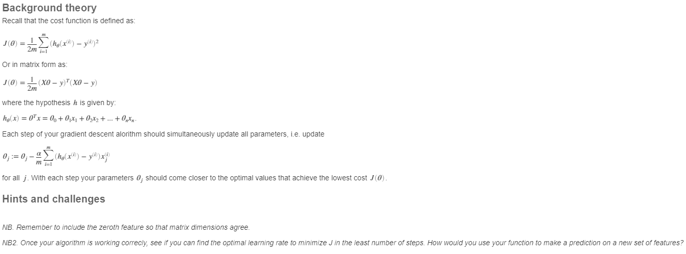

# Assignment 1 (MATLAB)

## Instructions

1. Write an algorithm that performs gradient descent on a multivariate linear function
2. Calculate the cost function

Use the vector form of cost and gradient with regularization. It takes in the following parameters:

* `X`, the matrix of features
* `y`, the vector of labels
* `\theta`, the vector of parameters (weights)
* `\alpha`, the learning rate
* `N`, the maximum number of iterations performed

It should return an updated vector of weights `\theta` and a vector of historical cost function values at each step `J_hist`.



## Pseudocode

Since only discussion is allowed and not sharing of code; I'll use psuedocode in Python3 here for my notes.

```python
import math

def Feature_Scaling(X):
    """
    Returns the standardized data points as X_norm, mean mu, standard deviation sigma
    """
    mu = sum(X) / len(X)                            # Calculate mean
    sigma = sum(pow(X-mu,2) for data in X) / len(X) # Calculate standard deviation
    X_norm = (X-mu)/sigma                           # Calculate standardised data points
    return [X_norm, mu, sigma]

def Cost_Function_and_Gradient(X, y, theta):
    """
    Computes cost function J (scalar) and gradient G (same dimensions as theta)
    """
    m = len(X)
    J = 1/(2*m) * (X*theta - y).T * (X*theta - y)   # Vector format; won't run in python
    G = 1/m * (X).T * (X*theta - y)                 # Gradient
    return [J,G]

def Gradient_Descent(X, y, theta, alpha, N)
    """
    Performs gradient descent for a linear regression with parameters theta to fit the data points in X and y.
    N iterations, alpha learning rate.
    Returns the optimised parameters theta and history of cost function J_hist.
    """
    J_hist = []
    # Loop for each iteration:
    for i in range(N):
        # Update theta
        J, G = Cost_Function_and_Gradient(X, y, theta)
        theta = theta - alpha * G
        # Append J_hist with the new cost value
        J_hist.append(J)

    return [theta, J_hist]
```


